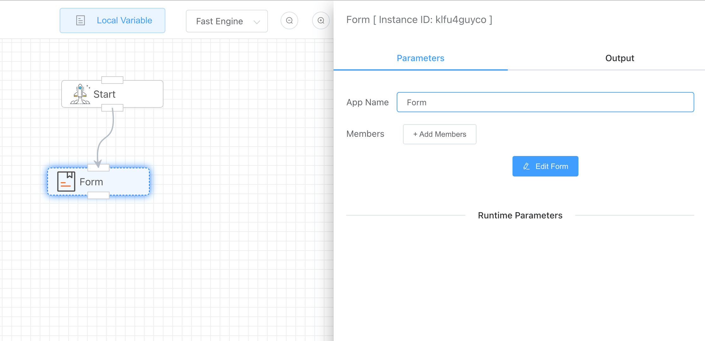
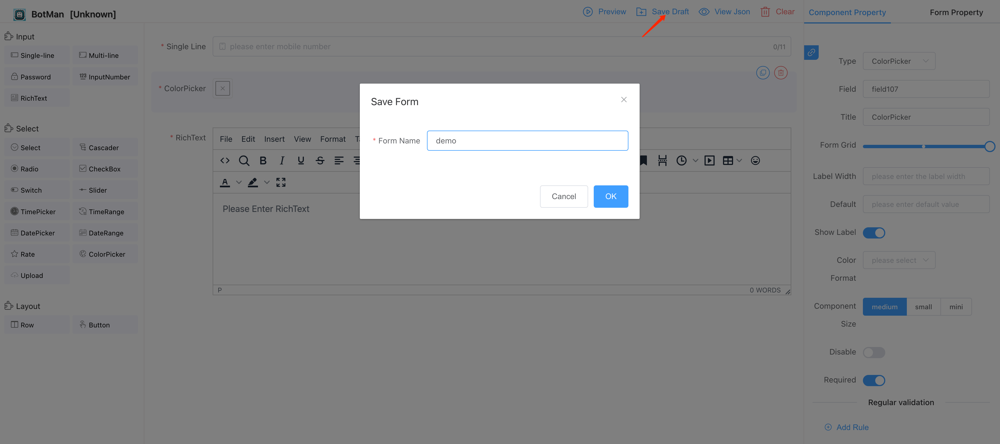
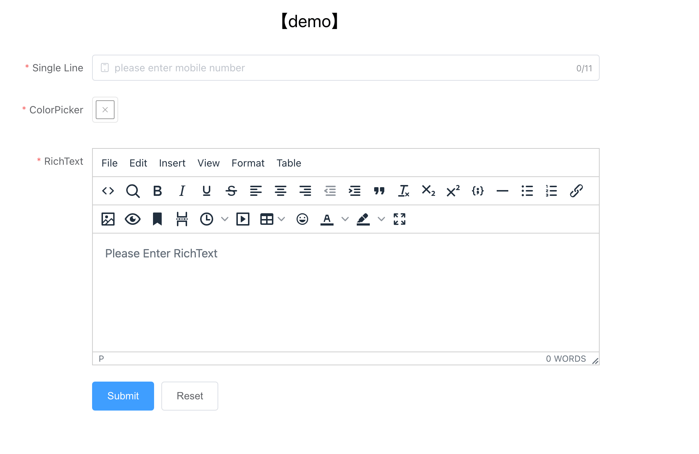
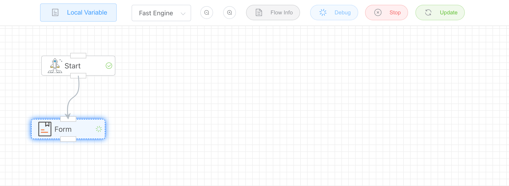
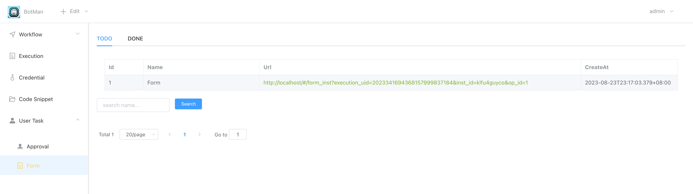
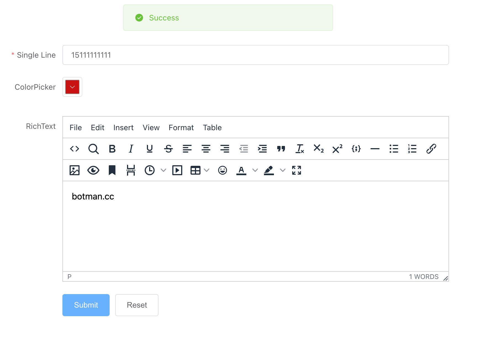
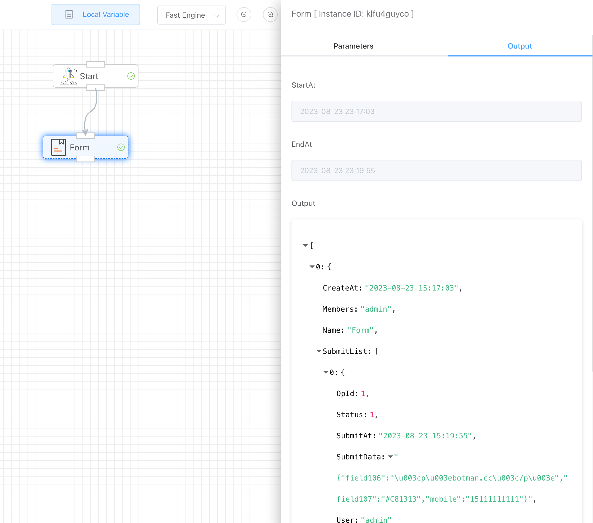

## Indroduction

Same function as [Form Trigger], the only difference is that one is used to trigger workflow execution at the starting node, and the other can be used as a form to interact with users in the middle of the process.

**Remarks**: When using form, you also need to save the workflow first to generate a workflow id, which is used to associate with the form.

## Configure [Members]

Members with permission to fill out the form.

## Design form

Click [Edit Form] jump to form editor.

After saving form, you can click the **[Preview]** button to view the actual  effect.

## Submit form

Let's try to debug the workflow and create a form instance.

> Debug

And go to [User Task>Form] page , you can see the form link

> Submit

Submit the form instance and finished the execution.

> Result

Back to the workflow editor, you can get the output of the submitted form instance.

